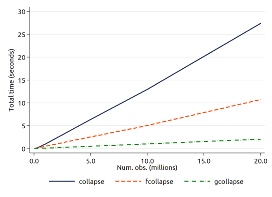

# FTOOLS: A faster Stata for large datasets


[](https://zenodo.org/badge/latestdoi/63449974)
- Jump to: [`usage`](#usage) [`benchmarks`](#benchmarks) [`install`](#installation)

-----------

## Introduction

Some of the most common Stata commands (collapse, merge, sort, etc.) are not designed for large datasets. This package provides alternative implementations that solves this problem, speeding up these commands by 3x-10x:



Other user commands that are very useful for speeding up Stata with large datasets include:

- [`gtools`](https://github.com/mcaceresb/stata-gtools), a package similar to `ftools` but written in C. In most cases it's much faster than both ftools and the standard Stata commands, as shown in the graph above. Try it out!
- [`sumup`](https://github.com/matthieugomez/sumup.ado) provides fast summary statistics, and includes the `fasttabstat` command, a faster version of `tabstat`.
- [`egenmisc`](https://github.com/matthieugomez/stata-egenmisc) introduces the egen functions `fastxtile`, `fastwpctile`, etc. that provide much faster alternatives to `xtile` and `pctile`. Also see the [`fastxtile`](https://github.com/michaelstepner/fastxtile) package, which provides similar functionality.
- [`randomtag`](https://ideas.repec.org/c/boc/bocode/s457898.html) is a much faster alternative to `sample`.
- [`reghdfe`](https://github.com/sergiocorreia/reghdfe/) provides a faster alternative to `xtreg` and `areg`, as well as multi-way clustering and IV regression.
- [`parallel`](https://github.com/gvegayon/parallel) allows for easier parallel computing in Stata (useful when running simulations, reshaping, etc.)
- [`boottest`](https://github.com/droodman/boottest), for efficiently running wild bootstraps.
- The [`rangerun`](https://ideas.repec.org/c/boc/bocode/s458356.html), [`runby`](https://ideas.repec.org/c/boc/bocode/s458413.html) and [`rangestat`](https://ideas.repec.org/c/boc/bocode/s458161.html) commands are useful for running commands and collecting statistics on rolling windows of observations.

`ftools` can also be used to speed up your own commands. For more information, see [this presentation](https://github.com/sergiocorreia/ftools/raw/master/docs/baltimore17_correia.pdf) from the 2017 Stata Conference (slides 14 and 15 show how to create faster alternatives to `unique` and `xmiss` with only a couple lines of code). Also, see `help ftools` for the detailed documentation.


## Details

**ftools** is two things:

1. A list of Stata commands optimized for large datasets, replacing commands such as: collapse, contract, merge, egen, sort, levelsof, etc.
2. A Mata class (*Factor*) that focuses on working with categorical variables. This class is what makes the above commands fast, and is also what powers [`reghdfe`](https://github.com/sergiocorreia/reghdfe)

Currently the following commands are implemented:

- `fegen group` replacing `egen group`
- `fcollapse` replacing `collapse`, `contract` and most of `egen` (through the `, merge` option)
- `join` (and its wrapper `fmerge`) replacing `merge`
- `fisid` replacing `isid`
- `flevelsof` replacing `levelsof`
- `fsort` replacing `sort` (although it is [rarely](https://github.com/sergiocorreia/ftools/blob/master/test/bench_sort.do) faster than sort)


## Usage

```stata
* Stata usage:
sysuse auto

fsort turn
fegen id = group(turn trunk)
fcollapse (sum) price (mean) gear, by(turn foreign) freq

* Advanced: creating the .mlib library:
ftools, compile

* Mata usage:
sysuse auto, clear
mata: F = factor("turn")
mata: F.keys, F.counts
mata: sorted_price = F.sort(st_data(., "price"))
```

Other features include:

- Add your own functions to -fcollapse-
- View the levels of each variable with `mata: F.keys`
- Embed -factor()- into your own Mata program. For this, you can
  use `F.sort()` and the built-in `panelsubmatrix()`.

## Benchmarks

(see the *test* folder for the details of the tests and benchmarks)

### egen group

Given a dataset with 20 million obs. and 5 variables, we create the following variable, and create IDs based on that:

```stata
gen long x = ceil(uniform()*5000)
```

Then, we compare five different variants of egen group:

| Method               | Min    | Avg    |
|----------------------|--------|--------|
| egen id = group(x)           | 49.17 | 51.26 |
| fegen id = group(x)  | 1.44  | 1.53  |
| fegen id = group(x), method(hash0)      | 1.41  | 1.60  |
| fegen id = group(x), method(hash1)      | 8.87  | 9.35  |
| fegen id = group(x), method(stata)     | 34.73 | 35.43  |

Our variant takes roughly 3% of the time of egen group.
If we were to choose a more complex hash method, it would take 18% of the time.
We also report the most efficient method based in Stata (that uses `bysort`),
which is still significantly slower than our Mata approach.

Notes:

- The gap is larger in systems with two or less cores, and smaller in systems with many cores (because our approach does not take much advantage of multicore)
- The gap is larger in datasets with more observations or variables.
- The gap is larger with fewer levels

### collapse

On a dataset of similar size, we ran `collapse (sum) y1-y15, by(x3)` where `x3` takes 100 different values:

| Method                     | Time  | % of Collapse |
|----------------------------|-------|---------------|
| collapse … , fast          | 81.87 | 100%          |
| [sumup](https://github.com/matthieugomez/stata-sumup)                      | 56.18 | 69%           |
| fcollapse … , fast         | 38.54 | 47%           |
| fcollapse … , fast pool(5) | 28.32 | 35%           |
| tab ...                    | 9.39  | 11%           |

We can see that `fcollapse` takes roughly a third of the time of `collapse`
(although it uses more memory when moving data from Stata to Mata).
As a comparison, tabulating the data (one of the most efficient Stata operations) takes 11% of the time of `collapse`.

Alternatively, the `pool(#)` option will use very little memory (similar to `collapse`) at also very good speeds.

Notes:

- The gap is larger if you want to collapse fewer variables
- The gap is larger if you want to collapse to fewer levels
- The gap is larger for more complex stats. (such as median)
- `compress`ing the by() identifiers beforehand might lead to significant improvements in speed (by allowing the use of the internal hash0 function instead of hash1).
- In a computer with less memory, it seems `pool(#)` might actually be faster.


#### collapse: alternative benchmark

We can run a more complex query, collapsing means and medians instead of sums, also with 20mm obs.:


| Method                     | Time  | % of Collapse |
|----------------------------|-------|---------------|
| collapse … , fast          | 81.06 | 100%          |
| [sumup](https://github.com/matthieugomez/stata-sumup)                      | 67.05 | 83%           |
| fcollapse … , fast         | 30.93 | 38%           |
| fcollapse … , fast pool(5) | 33.85 | 42%           |
| tab                        | 8.06  | 10%           |

*(Note: `sumup` might be better for medium-sized datasets, although some benchmarking is needed)*

And we can see that the results are similar.


### join (and fmerge)


Similar to `merge` but avoids sorting the datasets. It is faster than `merge`
for datasets larger than ~ 100,000 obs., and for datasets above 1mm obs. it
takes a third of the time.

[Benchmark:](https://github.com/sergiocorreia/ftools/blob/master/test/bench_merge.do)

| Method      | Time  | % of merge |
|-------------|-------|------------|
| merge       | 28.89 | 100%       |
| join/fmerge | 8.69  | 30%        |


### fisid

Similar to `isid`, but allowing for `if in` and on the other hand not allowing for `using` and `sort`.

In very large datasets, it takes roughly a third of the time of `isid`.


### flevelsof

Provides the same results as `levelsof`.

In large datasets, takes up to 20% of the time of `levelsof`.


### fsort

At this stage, you would need a significantly large dataset (50 million+) for `fsort` to be faster than `sort`.

| Method          | Avg. 1 | Avg. 2 |
|-----------------|--------|--------|
| sort id         | 62.52  | 71.15  |
| sort id, stable | 63.74  | 65.72  |
| fsort id        | 55.4   | 67.62  |

The table above shows the benchmark
on a 50 million obs. dataset.
The unstable sorting is slightly slower (col. 1) or slighlty faster (col. 2)
than the `fsort` approach. On the other hand, a stable sort is clearly
slower than `fsort` (which always produces a stable sort)

## Installation

### Stable Version

Within Stata, type:

```
cap ado uninstall ftools
ssc install ftools
```

### Dev Version

With Stata 13+, type:

```
cap ado uninstall ftools
net install ftools, from(https://github.com/sergiocorreia/ftools/raw/master/src/)
```

For older versions, first download and extract the [zip file](https://github.com/sergiocorreia/ftools/archive/master.zip), and then run

```
cap ado uninstall ftools
net install ftools, from(SOME_FOLDER)
```

Where *SOME_FOLDER* is the folder that contains the *stata.toc* and related files.

### Compiling the mata library

In case of a Mata error, try typing `ftools` to create the Mata library (lftools.mlib).


### Installing local versions

To install from a git fork, type something like:

```
cap ado uninstall ftools
net install ftools, from("C:/git/ftools/src")
ftools, compile
```

(Changing "C:/git/" to your own folder)

### Dependencies

The `fcollapse` function requires the [`moremata`](https://ideas.repec.org/c/boc/bocode/s455001.html) package for some the median and percentile stats:

```
ssc install moremata
```

Users of Stata 11 and 12 need to install the [`boottest`](https://ideas.repec.org/c/boc/bocode/s458121.html) package:

```
ssc install boottest
```

## FAQ:

### "What features is this missing?"

- You can create levels based on one or more variables, and on numeric or string variables, but *not* on combinations of both. Thus, you can't do something like `fcollapse price, by(make foreign)` because make is string and foreign is numeric. This is due to a limitation in Mata and is probably a hard restriction. As a workaround, just run something like `fegen id = group(make)`, to create a numeric ID.
- Support for weights is incomplete (datasets that use weights are often relatively small, so this feature has less priority)
- Some commands could also gain large speedups (merge, reshape, etc.)
- Since Mata is ~4 times slower than C, rewriting this in a C plugin should lead to a large speedup.

### "How can this be faster than existing commands?"

Existing commands (e.g. sort) are often compiled and don't have to move data
from Stata to Mata and viceversa.
However, they use inefficient algorithms, so for datasets large enough, they are slower.
In particular, creating identifiers can be an ~O(N) operation if we use hashes instead of sorting the data (see the help file).
Similarly, once the identifiers are created, sorting other variables by these identifiers can be done as an O(N) operation instead of O(N log N).

### "But I already tried to use Mata's `asarray` and it was much slower"

Mata's `asarray()` has a key problem: it is very slow with hash collisions (which you see a lot in this use case). Thus, I avoid using `asarray()` and instead use `hash1()` to create a hash table with open addressing (see a comparision between both approaches [here](http://www.algolist.net/Data_structures/Hash_table/Open_addressing#open_addressing_vs_chaining)).


## Updates

- `2.49.0 06may2022`: fixed a bug in `fcollapse` with quantiles (p**, median, and iqr stats). `ftools` computes these statistics using `moremata` and had failed to update its function arguments as required by recent changes in moremata.